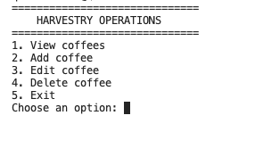
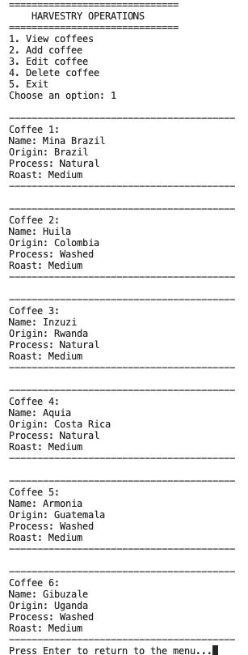

# Harvestry Operations ☕

Harvestry Operations is a command-line Python application built to manage Harvestry Coffee's coffee inventory.

The project was created as a learning exercise while studying Python and software development, with the long-term goal of evolving into a complete coffee operations management system.

---

## Features

- View coffee inventory
- Add new coffees
- Edit existing coffees
- Delete coffees
- Confirmation before deleting coffees
- Automatic JSON persistence (data is saved between program runs)

---

## Screenshots

### Main Menu



### Coffee Inventory



---

## Getting Started

### Clone the repository

```bash
git clone https://github.com/qussairamzi/harvestry-operations.git
cd harvestry-operations
```

### Run the application

Requires Python 3.

```bash
python3 main.py
```

---

## Technologies

- Python 3
- JSON
- Git
- GitHub

---

## Current Project Structure

```
harvestry-operations/
│
├── main.py
├── coffees.json
├── README.md
├── LICENSE
├── .gitignore
└── screenshots/
    ├── menu.png
    └── coffees.png
```

---

## Roadmap

### ✅ Completed

- Interactive menu
- View coffees
- Add coffees
- Edit coffees
- Delete coffees
- JSON persistence

### 🚧 Planned

- Search coffees
- Filter coffees by origin
- Sort coffees
- Roast profile management
- Import / Export
- SQLite database
- Reporting dashboard

---

## License

This project is licensed under the MIT License.

---

## Author

Developed by **Qussai Ramzi**

GitHub:
https://github.com/qussairamzi